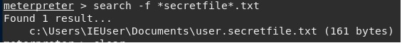

GoodSecurity Penetration Test Report 

Eric_Casper@GoodSecurity.com

1-19-2021

#### High-Level Summary

GoodSecurity was tasked with performing an internal penetration test on GoodCorp’s CEO, Hans Gruber. An internal penetration test is a dedicated attack against internally connected systems. The focus of this test is to perform attacks, similar to those of a hacker and attempt to infiltrate Hans’ computer and determine if it is at risk. GoodSecurity’s overall objective was to exploit any vulnerable software and find the secret recipe file on Hans’ computer, while reporting the findings back to GoodCorp.
When performing the internal penetration test, there were several alarming vulnerabilities that were
identified on Hans’ desktop. When performing the attacks, GoodSecurity was able to gain access to his machine and find the secret recipe file by exploit two programs that had major vulnerabilities. The details of the attack can be found in the ‘Findings’ category.

#### Severity Level:

#### Findings

Machine IP: 192.168.0.20
Hostname: MSEDGEWIN10

Vulnerability Exploited:
Exploit: windows/http/icecast_header

Vulnerability Explanation:
Vulnerability: CVE-2004-1561-Buffer Overflow vulnerability in Icecast Server HTTP Header

Attack type: Buffer Overflow
Attack Definition:  
Buffer Overflow is a temporary data storage area that has a limited space allocated for any single task.  Therefore, a buffer overflow attack occurs when input given to an application exceeds the allotted buffer memory.  The input is accepted and it overwrites other critical data.  
Severity:
Severe (7.5) -- Buffer Overflow attacks are very common and pose a serious threat to operating systems and user applications.  I believe Goodcorp needs to do everything possible to mitigate this vulnerability.

#### Proof of Concept:

### Recommendations

Below are my recommendations for GoodCorp and Mr. Gruber to implement.  Although not every recommendation needs to be taken, I strongly encourage the company to address one remedy immediately.  
-	Upgrade Icecast to version 2.0.2: Icecast version 2.0.2 has all the necessary updates to prevent this vulnerability.

-	Set up a Wireless Application Firewall (WAF): A WAF can prevent Buffer Overflow attacks by setting the accepted maximum thresholds for aspects of HTTP requests, and blocking requests that exceed the configured limits.
-	Patch outdated systems:	Don’t wait for issues like this vulnerability to happen.  Patch any outdated servers immediately. Be proactive and set up a system to have servers patched regularly.
-	Remove Icecast: If Icecast is not a valued business resource, consider removing altogether. 

